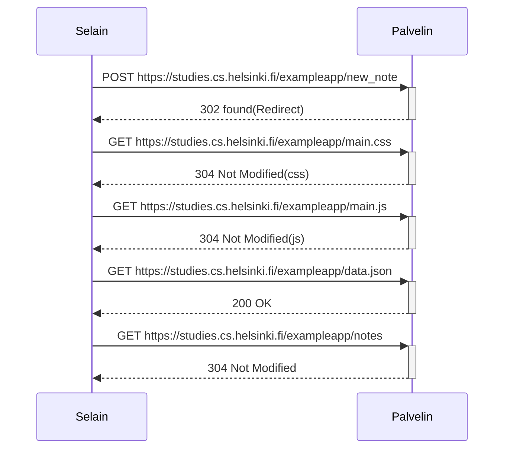

```mermaid
sequenceDiagram;

participant Selain
participant Palvelin


Selain->>+Palvelin: POST https://studies.cs.helsinki.fi/exampleapp/new_note
Palvelin-->>-Selain: 302 found(Redirect)


Selain->>+Palvelin: GET https://studies.cs.helsinki.fi/exampleapp/main.css
Palvelin-->>-Selain: 304 Not Modified(css)


Selain->>+Palvelin: GET https://studies.cs.helsinki.fi/exampleapp/main.js
Palvelin-->>-Selain: 304 Not Modified(js)


Selain->>+Palvelin: GET https://studies.cs.helsinki.fi/exampleapp/data.json
Palvelin-->>-Selain: 200 OK


Selain->>+Palvelin: GET https://studies.cs.helsinki.fi/exampleapp/notes
Palvelin-->>-Selain: 304 Not Modified

```

